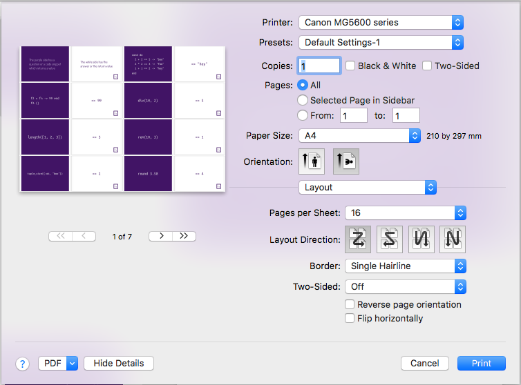
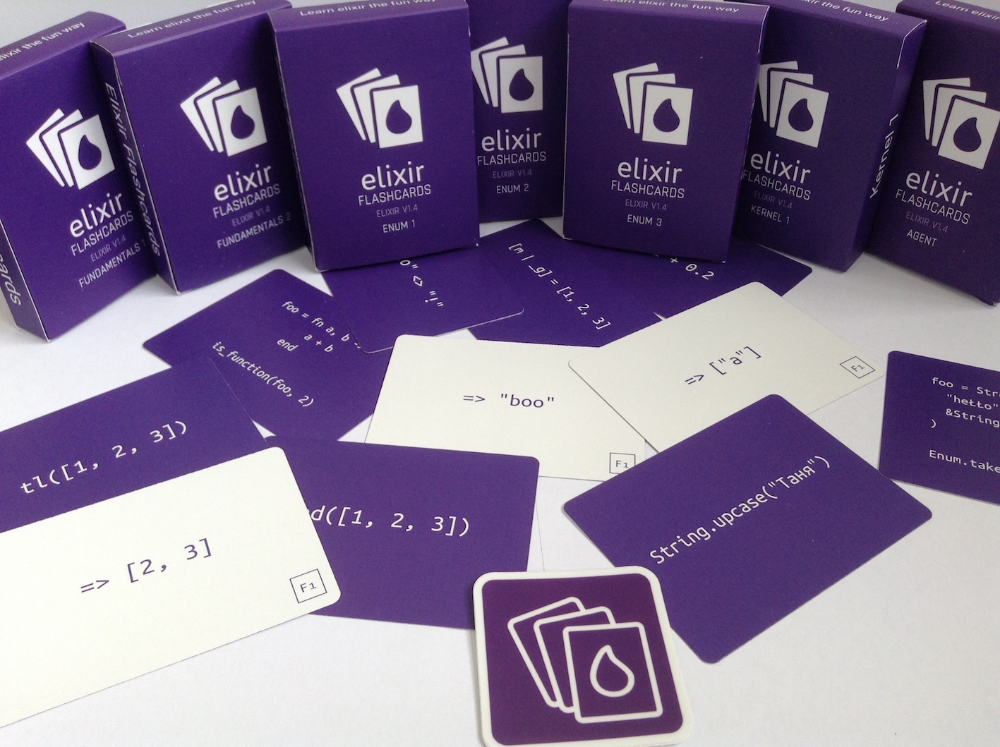
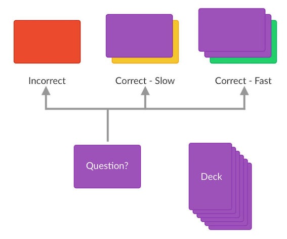
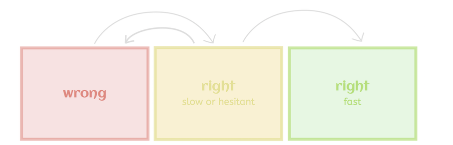
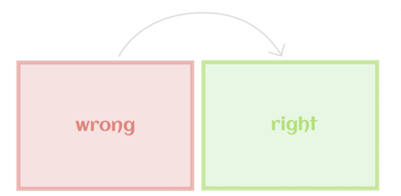
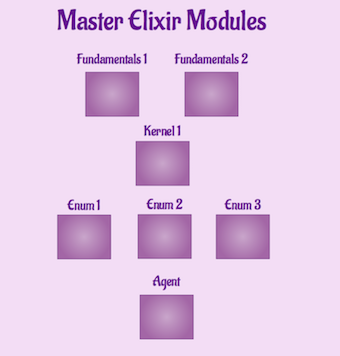

# Elixir Flashcards

Here you can find pdfs to print your own elixir-flashcards.

Each pdf file contain front(question) and the back(answer) side of the cards.
Download pdf and print. All cards are laid out ready to be printed. Enjoy!

The cards are intended to be printed on A4 sheet of paper using the multiple
pages per sheet as shown here:

Article with result of research done by cognitive psychologist on effectiveness
of various learning techniques could be [found here](http://bigthink.com/neurobonkers/assessing-the-evidence-for-the-one-thing-you-never-get-taught-in-school-how-to-learn)

## Help

If you would like to get help or information about where and how to print cards -
contact me on [twitter](https://twitter.com/Tetiana12345678)

## Professional Printing

If you would like professionally printed poker size flashcards like this visit [elixircards.co.uk](http://www.elixircards.co.uk).

## What flashcards are good for

Flashcards are good revisioning tool. They are most effective when you already familiar with the subject.

#### Flashcards good at:

* highlighting knowledge gaps
* finding misconceptions or false believes
* helping to memorize
* learning new details about the subject
* sparkling discussions around the subject in groups of people
* bringing people together to play games

#### Not good at:

* explaining why something is working in particular way
* giving general overview and understanding of the subject

Combining books, documentation, tutorials, screencasts to get familiar with the subject and using flashcards to fill in knowledge gaps and master the subject is the killer combination.

## Learning techniques

Flashcards can help you master a subject. This is how they can be used to help you learn. Thank you to Jesse J. Anderson for great explanation in 1 picture:

On this picture:

* 2 cards answered correctly and fast
* 1 card answered correctly, but slow or hesitant.

**Next time** you practice you only need to go through cards from red(incorrect) and yellow(correct, but slow) pile.

The goal is to migrate all the cards into a green pile. 

Cards from red pile move to yellow once answered correctly, cards from yellow pile can move into green or red or stay in yellow.

**Alternatevely** you can simplify this flow to only have red and green piles.

For the best result combine learning using flashcards with **spaced repetition** learning technique. With spaced repetition technique you would schedule your learning practices spaced in time. It could be a day, few days, week, month apart from each other. The longer gap is, longer you would remember what you've learned.

### Reward

We have created an example of achievement table to keep progress (master_elixir.pdf).

## Play games with flashcards

[Here](https://goo.gl/xJrUkP) you can find ideas of using cards in a fun way.

## Feedback

If you find a mistake please open an issue and I will look at it.
Feedback, suggestions are welcome :)
To share your feedback you can:

* open up an issue and we will discuss what can be improved.
* drop me message on twitter [here](https://twitter.com/Tetiana12345678)

## Contribution

To help elixir flashcard pool grow faster you can add new cards to our library
by submitting [simple form](https://goo.gl/nwTfQo)

## License

Elixir flashcards are available under a Creative Commons BY-NC-SA 2.0 license.

You are free to:

* **Share** — copy and redistribute the material in any medium or 
* format **Adapt** — remix, transform, and build upon the material

The licensor cannot revoke these freedoms as long as you follow the license terms.

Under the following terms:

* **Attribution** — You must give appropriate credit, provide a link to the license,
and indicate if changes were made. You may do so in any reasonable manner, but
not in any way that suggests the licensor endorses you or your use.
* **NonCommercial** — You may not use the material for commercial purposes.
* **ShareAlike** — If you remix, transform, or build upon the material, you must
distribute your contributions under the same license as the original.

See [LICENSE](LICENSE.md) for details.
